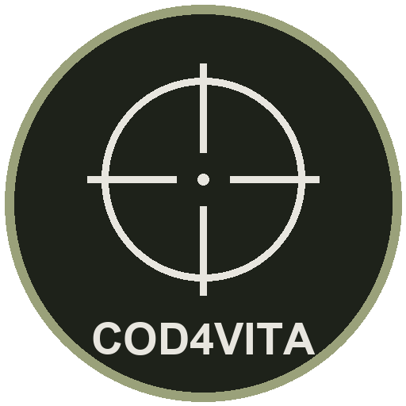

<a id="readme-top"></a>

<div align="center">



<h3 align="center">COD4VITA</h3>

<p align="center">
  <b>Call of Duty 4: Modern Warfare — single-player, on the PS Vita</b>
  <br />
  <br />
  A native port of Call of Duty 4's single-player campaign (IW 3.0 engine) to the PS Vita,
  <br />
  built on <a href="https://github.com/SwagSoftware/KisakCOD">KisakCOD</a> with a native sceGxm rendering backend.
  <br />
  <br />
  <b>Consider this a proof of concept.</b>
  <br />
  <br />
  <a href="#setup-for-players">Setup</a>
  &nbsp;·&nbsp;
  <a href="#controls">Controls</a>
  &nbsp;·&nbsp;
  <a href="../../issues">Report Bug</a>
</p>

[![build][build-shield]][build-url]&nbsp;[![issues][issues-shield]][issues-url]&nbsp;[![last commit][commit-shield]][commit-url]

[![platform][platform-shield]][platform-url]&nbsp;[![renderer][renderer-shield]][renderer-url]&nbsp;[![engine][engine-shield]][engine-url]&nbsp;[![license][license-shield]][license-url]

</div>

<details>
  <summary>Table of Contents</summary>
  <ol>
    <li><a href="#status">Status</a></li>
    <li><a href="#setup-for-players">Setup (for players)</a></li>
    <li><a href="#controls">Controls</a></li>
    <li><a href="#build-for-developers">Build (for developers)</a></li>
    <li><a href="#credits">Credits</a></li>
    <li><a href="#license">License</a></li>
  </ol>
</details>

## Status

**In development — currently unplayable.** It boots and loads, but crashes and freezes stop
it before or shortly after gameplay begins.

| Part | State |
| --- | --- |
| Engine | boots, menus work, level loads run; reaching stable gameplay is the current goal |
| Renderer | native sceGxm; the game's 609 shaders translated offline and registered on device |
| Movies | hardware AVC decode (sceVideodec) with AAC audio |
| Sound | full mixer, load-time IMA-ADPCM; music and streams play |
| Performance | CPU-bound; NPC-heavy scenes run well below 30 fps |
| Known issues | NPC animation bugs under investigation, lighting artifacts on some maps, memory pressure on the biggest levels |

Full build and asset-prep detail: [docs/BUILDING.md](docs/BUILDING.md).

## Setup (for players)

You need your own copy of Call of Duty 4 (PC). Assets are prepared once on a PC:

1. Install the release VPK.
2. Copy `zone/english` from your install to `ux0:data/kisakcod/zone/`.
3. Repack the texture archives with `scripts/vita/iwi_strip.py` and copy them to
   `ux0:data/kisakcod/main/`.
4. Re-encode the cinematics with `scripts/vita/convert_video.py` (needs ffmpeg) into
   `ux0:data/kisakcod/video/`.
5. Build `shaders.kgxp` (see [docs/BUILDING.md](docs/BUILDING.md)) and copy it to
   `ux0:data/kisakcod/`.

## Controls

### Sticks

| Stick | Action |
|:--:|--------|
|  | Move |
|  | Look |

### Base layer (physical buttons)

| Button | Action |
|:--:|--------|
|  | Fire |
|  | Aim down sights |
|  | Jump / stand |
|  | Crouch |
|  | Use / reload |
|  | Switch weapon |
|  | Night vision |
|  | Prone |
|   | Smoke / frag grenade |
|  | Sprint / hold breath |
|  | Pause |

### Rear touch panel

| Zone | Action |
|:--:|--------|
|  | Sprint |
|  | Melee |

In menus,  confirms and
 backs out. Defaults are written to
`ux0:data/kisakcod/raw/vita_controls.cfg` on first boot; every control is a bindable key
(`AUX1`–`AUX13`), so edit that file to rebind.

## Build (for developers)

Needs [VitaSDK](https://vitasdk.org), CMake and Python 3. On Windows, run from Git Bash.

```bash
bash tools/build.sh -DSHADER_ARCHIVE=/path/to/shaders.kgxp   # -> build/COD4VITA.vpk
```

A build without `SHADER_ARCHIVE` compiles with fallback shaders — that is what CI does.
Asset generation (shaders, textures, video, LiveArea) is covered in
[docs/BUILDING.md](docs/BUILDING.md).

## Credits

- [KisakCOD](https://github.com/SwagSoftware/KisakCOD) — the CoD4 single-player reconstruction
- [VitaSDK](https://vitasdk.org) — toolchain and headers
- Infinity Ward — the game

## License

GPLv3, matching upstream KisakCOD — see [LICENSE](LICENSE). No game assets are included; they
must come from your own copy of Call of Duty 4.

Unofficial, non-commercial fan port — not affiliated with or endorsed by Activision or
Infinity Ward. *Call of Duty* is a trademark of its owners; you must own a legal copy to play.

<p align="right">(<a href="#readme-top">back to top</a>)</p>

<!-- BADGES -->

[build-shield]: https://img.shields.io/github/actions/workflow/status/NDRWhun/COD4VITA/build-vita.yml?branch=vita-port&label=build&style=flat-square
[build-url]: ../../actions/workflows/build-vita.yml
[issues-shield]: https://img.shields.io/github/issues/NDRWhun/COD4VITA?label=issues&style=flat-square
[issues-url]: ../../issues
[commit-shield]: https://img.shields.io/github/last-commit/NDRWhun/COD4VITA/vita-port?label=updated&style=flat-square
[commit-url]: ../../commits/vita-port
[platform-shield]: https://img.shields.io/badge/platform-PS%20Vita-4b6cb7?style=flat-square
[platform-url]: https://vitasdk.org
[renderer-shield]: https://img.shields.io/badge/renderer-native%20sceGxm-8a4fff?style=flat-square
[renderer-url]: src/vita/gxm
[engine-shield]: https://img.shields.io/badge/engine-IW%203.0-5f3dc4?style=flat-square
[engine-url]: https://en.wikipedia.org/wiki/IW_engine
[license-shield]: https://img.shields.io/badge/license-GPLv3-blue?style=flat-square
[license-url]: LICENSE
